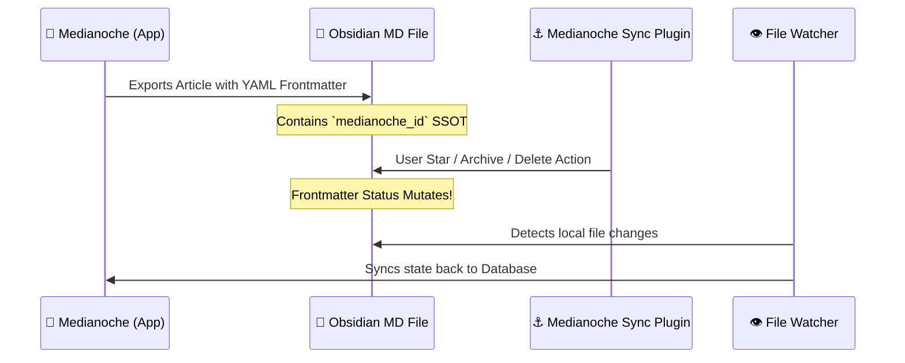

# ⚓️ Medianoche Sync

[](https://obsidian.md)
[](https://medianoche.app)
[](https://github.com/ohida/medianoche-sync/releases)
[](https://opensource.org/licenses/MIT)

> [!TIP]
> **Medianoche Sync** is the official Obsidian plugin that seamlessly connects your offline Markdown files with [Medianoche](https://medianoche.app) — a next-generation, AI-powered RSS reader. Star, archive, or delete your articles directly in Obsidian, and watch the status sync instantly to your main reader vault! 🌌✨

---

## 🌟 Key Features

### ⚡️ Triage Directly inside Obsidian
No need to switch apps. Mark reading status on the go:
* ⭐ **Star / Favorite**: Mark articles as starred to keep them in your curated highlights.
* 📦 **Archive**: Archive articles to keep your Inbox clean and focused.
* 🗑️ **Delete**: Instantly mark articles for deletion with a clean, responsive confirmation dialog.

### 🎨 Premium Adult Modern UI Integration
Designed to blend seamlessly with your Obsidian theme:
* 📖 **Reading View (Post-Processor)**: A beautifully styled Action Bar floats at the bottom of synced articles.
* ⚡ **Live Preview & Source Mode**: Perfectly styled active header icon badges (Star, Archive, Delete).
* 📱 **Mobile-First Responsive Design**: Optimized tap targets, full widths, and smooth micro-animations for iPad and iPhone.

### ⌨️ Speedrunning Hotkeys
For keyboard-only power users:
* **Toggle Star**: `Cmd + Shift + S` (Mac) / `Ctrl + Shift + S` (Windows)
* **Toggle Archive**: `Cmd + Shift + A` (Mac) / `Ctrl + Shift + A` (Windows)
* **Toggle Delete**: `Cmd + Shift + D` (Mac) / `Ctrl + Shift + D` (Windows)

---

## 🚀 How It Works



---

## 🧩 Frontmatter Strategy

Only Markdown files featuring the `medianoche_id` namespace in their frontmatter are managed by the plugin. This prevents collisions with your personal notes:

```yaml
---
medianoche_id: 12345
medianoche_starred: false
medianoche_archived: false
medianoche_deleted: false
---
```

---

## 🔌 Installation

### 1. From Obsidian Community Plugins (Recommended)
1. Open **Obsidian Settings** → **Community plugins**.
2. Click **Browse** and search for `Medianoche Sync`.
3. Click **Install**, then **Enable**.
4. You are good to go! 🪐

### 2. Manual Installation (For Developers / Testers)
1. Head over to [GitHub Releases](https://github.com/ohida/medianoche-sync/releases) and download the latest asset package (containing `main.js`, `manifest.json`, and `styles.css`).
2. Create a folder in your Obsidian vault at `.obsidian/plugins/medianoche-sync/`.
3. Extract the downloaded files into that folder.
4. Go to **Obsidian Settings** → **Community plugins** and enable **Medianoche Sync**.

---

## ⚙️ Requirements

* **Medianoche App** (Pro desktop application with Obsidian Sync active)
* **Obsidian v1.0.0** or later

---

## 🛠️ Local Development

Feel like extending the plugin or making it even shinier? We welcome developers!

```bash
# Clone the repository and install deps
npm install

# Run the live bundler (watch mode)
npm run dev

# Build the optimized production bundle
npm run build
```

---

## 📄 License

This project is licensed under the [MIT License](file:///Users/ohida/Codes/medianoche-sync/LICENSE).

**Let's build a beautiful, zen-like reading ecosystem together! 🌸✨**
